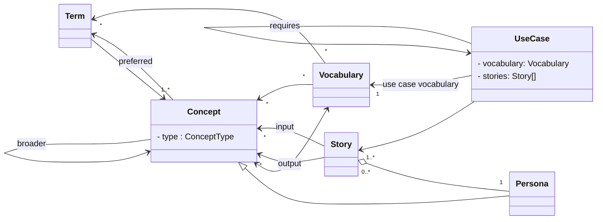

# Concept

For every given Use Case we want to start with capturing the concepts and
terms that the user or "the business" uses or wants to use.

Most of these concepts and their terms will be pre-defined in all kinds of
vocabularies but for brand-new use cases in a new domain concepts and their
terms will have to be created.

