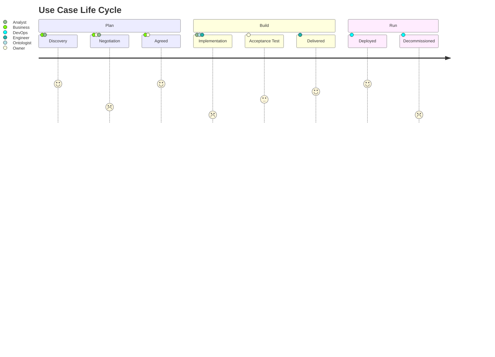

# Use Case

A Use Case specifies a distinct set of business requirements --- captured
as an "executable model" --- resulting in a specific business outcome.

## Life cycle

Use Cases go through a life-cycle of continuous improvement such as:[^1]

[^1]: the life-cycle diagram shown is obviously a simplification

## Key components

For every Use Case we specify:

- A name and a description
- The desired or expected business outcome(s) and how they can be measured
- The ["personas"](persona.md) of all the people and systems that are involved
  in the domain or scope represented by the Use Case
- The concepts and their terms as they're used in the context of the Use Case

At a later stage in the life-cycle of the Use Case we add:

- The stories, see [Story](story.md)
- The datasets and their ontologies
- The workflows

Specialists of various disciplines in the organization can add their details
such as:

- detailed business rationale, tied to the before-mentioned business outcomes
- milestones, versions, projects, timelines, roadmaps, budgets
- issues, tickets
- environment topologies, deployments and configurations
- detailed information about the various types of dependencies

## Tech Audience

The term "use case" means something specific to a technical audience who
usually assume that the term use case means what the Object Management Group (OMG)
defines what it is in their Unified Modeling Language (UML) and
its ["use case diagrams"](https://en.wikipedia.org/wiki/Use_case_diagram).

Although there are many similarities and overlap --- which is why we are repurposing
the term --- it is not exactly the same, in our Use Case Tree Method:

- use cases often are used a much broader and more abstract container concept ---
  compared to a UML Use Case --- that can be put in a "tree structure" where at the
  highest levels of these trees a use case can represent a capability domain or 
  a "strategic use case" --- or basically anything that fits well with the business.
- at the lowest levels in this tree we would end up with use cases that are much more
  like turn-key components for the EKG, 100% reusable delivering "no code"-functionality[^1].

[^1]: [No-code](https://en.wikipedia.org/wiki/No-code_development_platform) or 
      [Low-code](https://en.wikipedia.org/wiki/Low-code_development_platform) development
      allows non-programmers to create applications without
      hard-wiring business logic with a programming language

  

