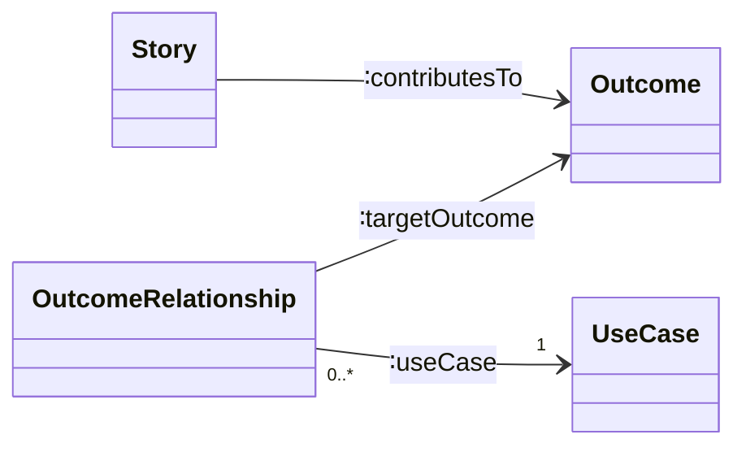

<!-- markdownlint-disable MD041 MD012 -->

```mermaid
classDiagram
  direction LR
  hide members

  class Outcome
  class UseCase
  class Story
  class OutcomeRelationship

  %% Outcome linkage (relationship-object)
  OutcomeRelationship "0..*" --> "1" UseCase : ∶useCase
  OutcomeRelationship --> Outcome : ∶targetOutcome

  %% Stories reference outcomes as "why"
  %% Mermaid classDiagram can't parse ASCII ':' inside labels; use ratio sign (∶) instead.
  Story --> Outcome : ∶contributesTo
```

