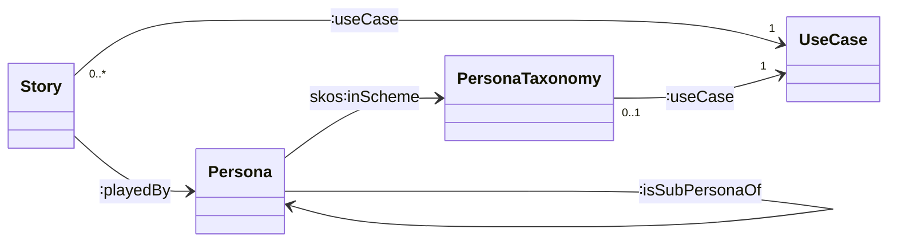

<!-- markdownlint-disable MD041 MD012 -->

```mermaid
classDiagram
  direction LR
  hide members

  class Persona
  class Story
  class UseCase
  class PersonaTaxonomy

  %% Personas show up in stories ("playedBy") which are owned by a use case
  Story --> Persona : ∶playedBy
  Story "0..*" --> "1" UseCase : ∶useCase

  %% Personas belong to a PersonaTaxonomy (SKOS concept scheme)
  Persona --> PersonaTaxonomy : skos∶inScheme
  PersonaTaxonomy "0..1" --> "1" UseCase : ∶useCase

  %% Persona inheritance (optional)
  Persona --> Persona : ∶isSubPersonaOf
```

