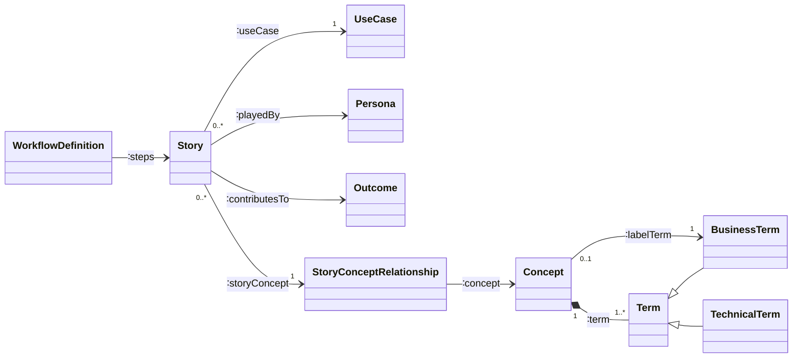

<!-- markdownlint-disable MD041 MD012 -->

```mermaid
classDiagram
  direction LR
  hide members

  class Story
  class UseCase
  class Persona
  class Outcome
  class Concept
  class Term
  class BusinessTerm
  class TechnicalTerm
  class WorkflowDefinition
  class StoryConceptRelationship

  %% Term specializations
  Term <|-- BusinessTerm
  Term <|-- TechnicalTerm

  %% Other resources point to UseCase (typical KG modeling style)
  Story "0..*" --> "1" UseCase : ∶useCase

  %% Story structure
  Story --> Persona : ∶playedBy
  Story --> Outcome : ∶contributesTo

  %% Concept usage
  Story "0..*" --> "1" StoryConceptRelationship : ∶storyConcept
  StoryConceptRelationship --> Concept : ∶concept
  Concept "1" *-- "1..*" Term : ∶term
  Concept "0..1" --> "1" BusinessTerm : ∶labelTerm

  %% Workflow participation
  WorkflowDefinition --> Story : ∶steps
```

