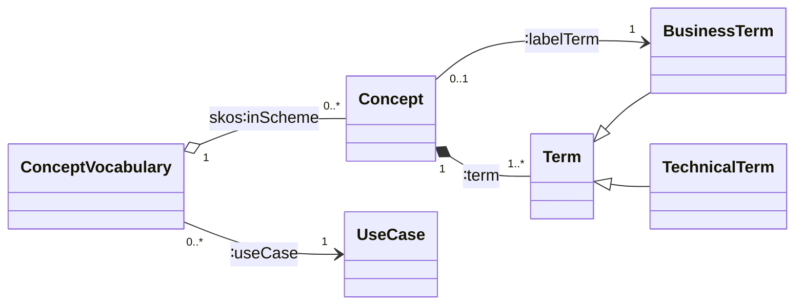

<!-- markdownlint-disable MD041 MD012 -->

```mermaid
classDiagram
  direction LR
  hide members

  class Term
  class BusinessTerm
  class TechnicalTerm
  class Concept
  class ConceptVocabulary
  class UseCase

  %% Term specializations
  Term <|-- BusinessTerm
  Term <|-- TechnicalTerm

  %% Ownership
  Concept "1" *-- "1..*" Term : ∶term
  Concept "0..1" --> "1" BusinessTerm : ∶labelTerm

  %% Context (terms live inside vocabularies used by use cases)
  %% Mermaid classDiagram can't parse ASCII ':' inside labels; use ratio sign (∶) instead.
  ConceptVocabulary "1" o-- "0..*" Concept : skos∶inScheme
  ConceptVocabulary "0..*" --> "1" UseCase : ∶useCase
```

