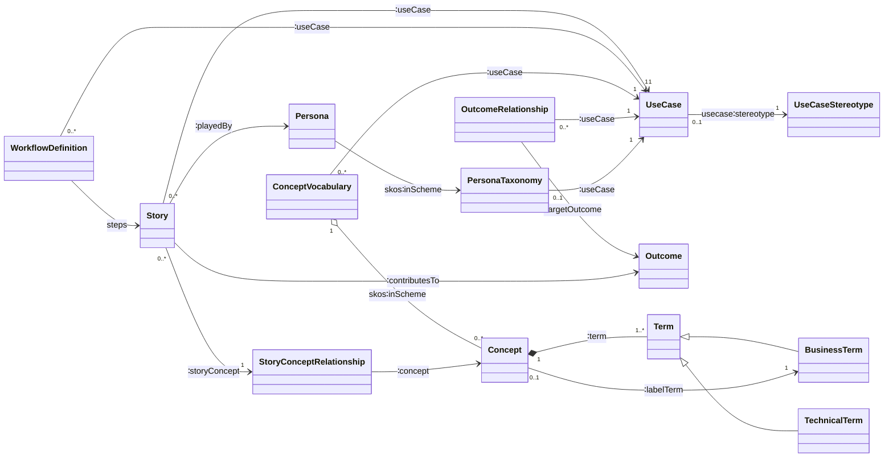

<!-- markdownlint-disable MD041 MD012 -->

```mermaid
classDiagram
  direction LR
  hide members

  class UseCase
  class UseCaseStereotype
  class Story
  class WorkflowDefinition
  class Outcome
  class OutcomeRelationship
  class ConceptVocabulary
  class Concept
  class Term
  class BusinessTerm
  class TechnicalTerm
  class Persona
  class StoryConceptRelationship
  class PersonaTaxonomy

  %% Term specializations
  Term <|-- BusinessTerm
  Term <|-- TechnicalTerm

  %% Other resources point to UseCase (typical KG modeling style)
  Story "0..*" --> "1" UseCase : ∶useCase
  WorkflowDefinition "0..*" --> "1" UseCase : ∶useCase
  ConceptVocabulary "0..*" --> "1" UseCase : ∶useCase
  OutcomeRelationship "0..*" --> "1" UseCase : ∶useCase
  PersonaTaxonomy "0..1" --> "1" UseCase : ∶useCase

  %% Local ownership / containment
  Concept "1" *-- "1..*" Term : ∶term
  Concept "0..1" --> "1" BusinessTerm : ∶labelTerm
  %% Mermaid classDiagram can't parse ASCII ':' inside labels; use ratio sign (∶) instead.
  ConceptVocabulary "1" o-- "0..*" Concept : skos∶inScheme

  %% Other key relationships
  UseCase "0..1" --> "1" UseCaseStereotype : usecase∶stereotype
  OutcomeRelationship --> Outcome : ∶targetOutcome

  %% Usage (high-level)
  Story --> Persona : ∶playedBy
  Story --> Outcome : ∶contributesTo
  Story "0..*" --> "1" StoryConceptRelationship : ∶storyConcept
  StoryConceptRelationship --> Concept : ∶concept
  WorkflowDefinition --> Story : steps

  %% Personas belong to a PersonaTaxonomy (SKOS concept scheme)
  Persona --> PersonaTaxonomy : skos∶inScheme
```

