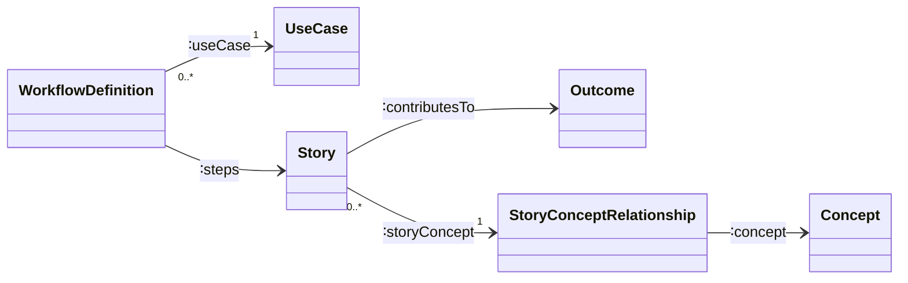

<!-- markdownlint-disable MD041 MD012 -->

```mermaid
classDiagram
  direction LR
  hide members

  class WorkflowDefinition
  class UseCase
  class Story
  class Outcome
  class Concept
  class StoryConceptRelationship

  %% Other resources point to UseCase (typical KG modeling style)
  WorkflowDefinition "0..*" --> "1" UseCase : ∶useCase

  %% Steps (relationship-object implied)
  WorkflowDefinition --> Story : ∶steps

  %% Stories link to outcomes and concepts
  Story --> Outcome : ∶contributesTo
  Story "0..*" --> "1" StoryConceptRelationship : ∶storyConcept
  StoryConceptRelationship --> Concept : ∶concept
```

