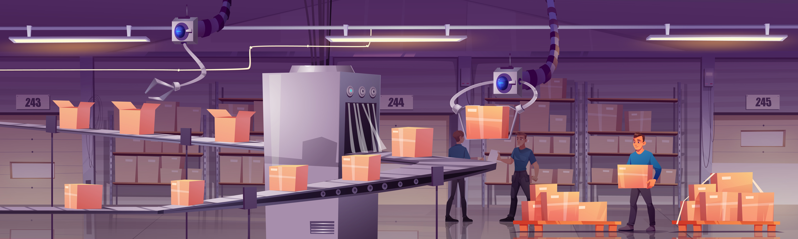

# Objectives

The primary reasons for creating a [Use Case Tree](../concept/use-case-tree.md) are:

<!--objectives-index-start-->

[^copyright]

- :material-cached:{ .lg } __Interoperability Achieved__
    
    
    [:octicons-arrow-right-24: Learn more](interoperability.md)

- :material-cached:{ .lg } __Business Composability Improved__
    
    
    [:octicons-arrow-right-24: Learn more](composable-business.md)

- :material-cached:{ .lg } __Requirements Captured__
    
    
    [:octicons-arrow-right-24: Learn more](know-what-the-business-wants.md)

- :material-cached:{ .lg } __Knowledge Captured__
    
    
    [:octicons-arrow-right-24: Learn more](capture-knowledge.md)

- :material-cached:{ .lg } __Gaps Bridged__
    
    
    [:octicons-arrow-right-24: Learn more](bridge-the-gap.md)

- :material-cached:{ .lg } __Expectations Managed__
    
    
    [:octicons-arrow-right-24: Learn more](manage-expectations.md)

- :material-cached:{ .lg } __Did not boil the ocean__
    
    
    [:octicons-arrow-right-24: Learn more](avoid-boiling-the-ocean.md)

- :material-cached:{ .lg } __Disruption Avoided__
    
    
    [:octicons-arrow-right-24: Learn more](avoid-disruption.md)

- :material-cached:{ .lg } __Quality Increased__
    
    
    [:octicons-arrow-right-24: Learn more](increase-quality.md)

- :material-cached:{ .lg } __Aligned with Strategy__
    
    
    [:octicons-arrow-right-24: Learn more](align-with-business-strategy.md)

- :material-cached:{ .lg } __Delivered__
    
    
    [:octicons-arrow-right-24: Learn more](strategic-usecases.md)

- :material-cached:{ .lg } __Modularity Managed__
    
    
    [:octicons-arrow-right-24: Learn more](modularity.md)

- :material-cached:{ .lg } __Reuse Enabled__
    
    
    [:octicons-arrow-right-24: Learn more](enable-reuse.md)

[^copyright]: [Conveyor belt vector created by upklyak - www.freepik.com](https://www.freepik.com/vectors/conveyor-belt)

<!--objectives-index-end-->
