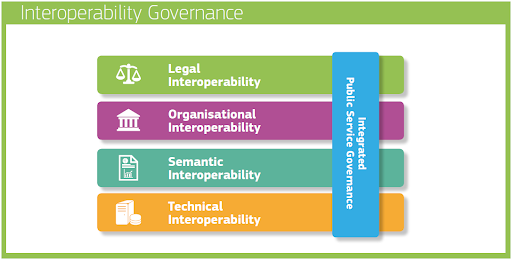

# Interoperability Achieved

<!--summary-start-->

_Enable interoperability across the enterprise at high levels of
maturity._

<!--summary-end-->

## The European Interoperability Framework (EIF)

In order to make the _free movement_ of goods between the 28 member
states of the European Union more efficient, effective timely, and of
high quality, these Member States are modernizing their public
administrations through digital public services. However, there is
still the risk of creating isolated digital environments and other
barriers that may prevent public administrators from connecting with
each other. Therefore, the European Commission has created the
_[European Interoperability Framework](https://en.wikipedia.org/wiki/European_Interoperability_Framework)
(EIF)_ to guide administrations within member states to set up and run
interoperable systems.  
Although this framework had been developed for governments of local
states, its contents can be applied to enterprises and this is the
purpose of this chapter.

First, Interoperability is defined by the European Commission (2017)
as; _“the ability of organisations to interact towards mutually
beneficial goals, involving the sharing of information and knowledge
between these organizations, through the business processes they
support, by means of the exchange of data between their ICT systems.”_

The European Interoperability Framework is based on 12 principles that
are fundamental behavioral aspects to drive interoperability actions.
Some of these principles are:

1. **Openness**. Data should be published and shared as much as
   possible. This could help save development costs, avoid a lock-in
   effect and create synergies within the enterprise. Additionally,
   the level of openness of a specification/standard is a key aspect
   of the reuse of the underlying data or software implementing that
   specification.
2. **Transparency**. Transparency in the EIF consists of (1)
   visibility, (2) availability of interfaces, and (3) the protection
   of personal data. First, visibility is about allowing other players
   such as customers, other businesses, and governments to view and
   understand administrative rules, processes, data, services, and
   decision-making. Second, interfaces between heterogeneous and
   disparate information systems are necessary to make these systems
   work together and their interfaces are thus crucial for
   interoperability. Third, applicable legal frameworks for handling
   large amounts of personal data such as GDPR should be respected.
3. **Reusability**. The reusability of IT solutions, information and
   data is an enabler of interoperability and improves quality because
   it extends operational use while saving money and time.
4. **Technological neutrality and data portability**. Technological
   neutrality (i.e. technology agnosticism) means focusing on
   functional needs and deferring decisions on technology as long as
   possible to minimize technological dependencies, to avoid imposing
   specific technical implementations or products on their
   constituents, and to be able to adapt to the rapidly evolving
   technological environment. Additionally, data portability refers to
   the ability to move and reuse data easily across different
   applications and systems as means to avoid lock-in and ensure
   interoperability as well.
5. **User-centricity**. User needs and requirements should guide the
   design and development of services in accordance with the three
   expectations. First, a multi-channel services delivery approach
   means that availability of alternative channels (physical and
   digital) to access a service and it is important as users may
   prefer different channels depending on the circumstances and their
   needs. Second, a single point of contact should be made available
   to users to hide internal administrative complexity and facilitate
   access to a service. Third, User feedback should be systematically
   collected, assessed, and used to design new services and to further
   improve existing ones.
6. **Administrative simplification**. Digitization of services should
   take place in accordance with (1) digital-by-default, (2)
   digital-first. The former means that there should be at least one
   digital channel available for each service. The latter concept
   means that priority must be given to using services via digital
   channels while applying the multi-channel delivery concept and
   no-wrong-door policy.
7. **Preservation of information**.
8. **Assessment of effectiveness and efficiency**.

The EIF describes an interoperability model that consists of four
layers as depicted in figure 1 below. This model depicts the so-called
interoperability governance which is defined as; _“decisions on
interoperability frameworks, institutional arrangements,
organizational structures, roles and responsibilities, policies,
agreements and other aspects of ensuring and monitoring
interoperability at national and EU levels.”_

<figure markdown>
  { width="700" }
  <figcaption>Fig 1: Interoperability Governance</figcaption>
</figure>

### Legal interoperability

Legal interoperability is about ensuring that organizations or parts
of organizations operating under different legal frameworks, policies,
and strategies are able to work together.

### Organizational interoperability

This interoperability layer concerns the way in which organizations
align their business processes, responsibilities, and expectations to
achieve commonly agreed and mutually beneficial goals. In practice,
organizational interoperability refers to documenting and integrating
or aligning business processes and relevant information exchanged.
Organizational interoperability also aims at meeting the requirements
of the user community by making services available, easily
identifiable, accessible, and user-focused.

### Semantic interoperability

This interoperability layer aims at ensuring that the precise format
and meaning of exchanged data and information is preserved and
understood throughout exchanges between parties.  It covers
semantics and syntax:

- **Semantics**  refers to the meaning of data elements and the
  relationships between them.
- **Syntax**  refers to describing the exact format of the
  information to be exchanged in terms of grammar and format.

### Technical interoperability

This covers the applications and infrastructures linking systems and
services. Aspects of technical interoperability include interface
specifications, interconnection services, data integration services,
data presentation and exchange, and secure communication protocols.

## The Use Case Tree Method as an enabler of interoperability

As business silos are isolated parts of an organization that either
work together in a rather dysfunctional way or do not work together at
all, we consider that achieving high levels of interoperability within
the enterprise is essential to allow these silos to work together and
create synergies among them.

The _Use Case Tree Method_ is a rationale by which enterprises could
design, build and deploy Enterprise Knowledge Graphs that, at high
levels of maturity, will enable interoperability across the
enterprise. Besides offering in semantic interoperability via
ontologies and machine-readable definitions of meaning, the
[Use Case Tree](../concept/use-case-tree.md) enables organizational by
offering the opportunity to different parts of an organization to
align their business processes, responsibilities, and expectations
through modular reusable business capabilities (i.e. use cases) that
are easy to deploy and have proven their value in the past.

Additionally, EKG and the Use Case tree method could help
organizations to reach higher levels of legal interoperability through
compliance.

## Related Content

- **[Use Case Tree](../concept/use-case-tree.md)** - The foundational
  structure that enables interoperability
- **[Ontology](../concept/ontology.md)** - Semantic models that
  provide interoperability at the data level
- **[Composable Business](composable-business.md)** - Building
  interoperable business capabilities
- **[Enable Reuse](enable-reuse.md)** - Reusable components enable
  interoperability
- **[Modularity](modularity.md)** - Modular design supports
  interoperability
